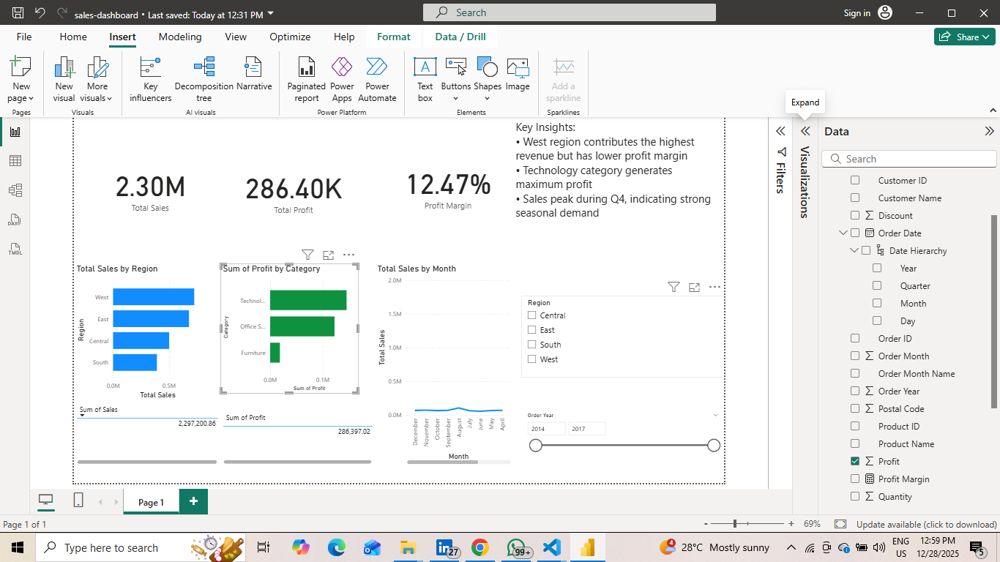

# powerbi-sales-dashboard
Interactive Sales Performance Dashboard built using Power BI

# Sales Performance Dashboard (Power BI)

## 📌 Overview
This project presents an interactive sales performance dashboard built using Power BI.
It helps management analyze revenue, profit, regional performance, and sales trends.

## 🔍 Business Problem
Sales data was available in raw format, making it difficult for decision-makers
to quickly understand performance across regions, products, and time periods.

## 🛠️ Solution
- Cleaned and prepared sales data using Python
- Built interactive Power BI dashboards with key KPIs
- Implemented slicers for dynamic analysis by year and region
- Added Month-over-Month growth using DAX time intelligence

## 📊 Key KPIs
- Total Sales
- Total Profit
- Profit Margin
- Month-over-Month Sales Growth

## 🧰 Tools Used
- Power BI
- DAX
- Python (Pandas)

## 📈 Key Insights
- West region generates the highest revenue
- Technology category is the most profitable
- Strong seasonal sales spike observed in Q4

## 📸 Dashboard Preview

## 🚀 How to Use
Download the `.pbix` file and open it in Power BI Desktop.

---
